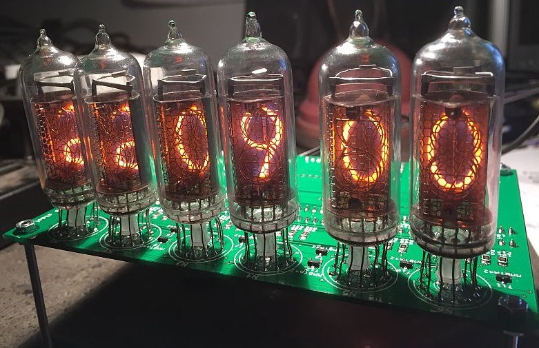
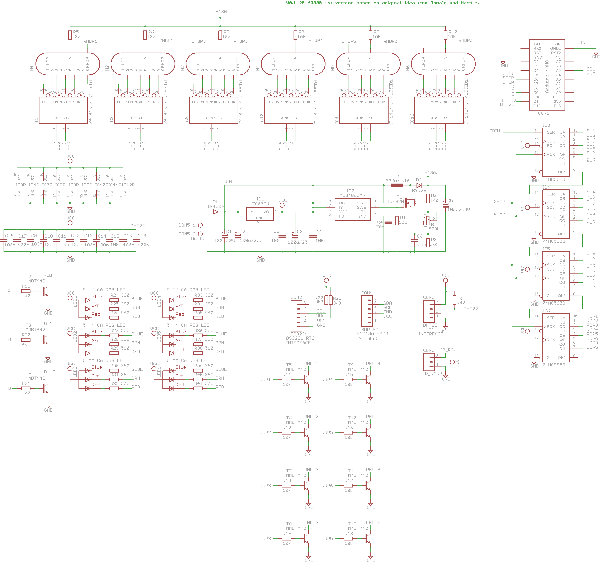
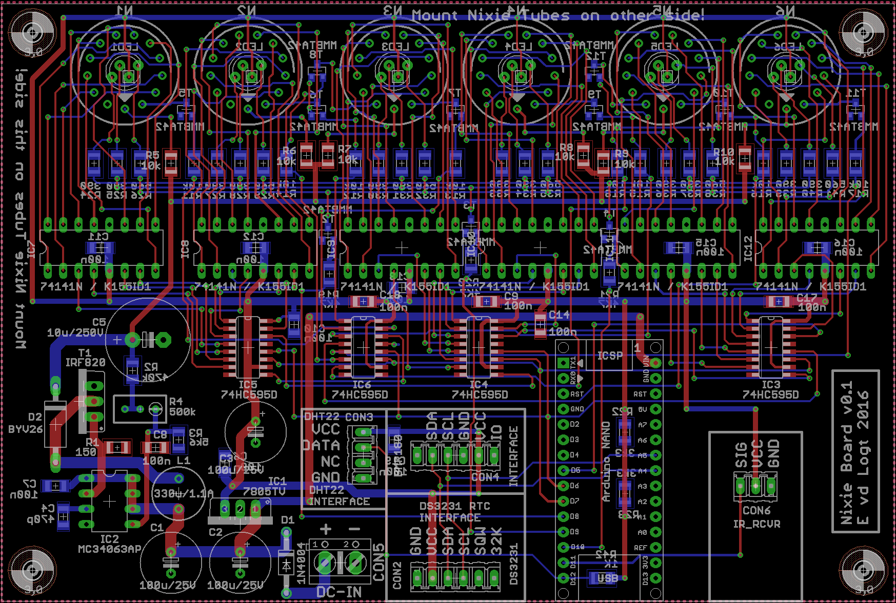
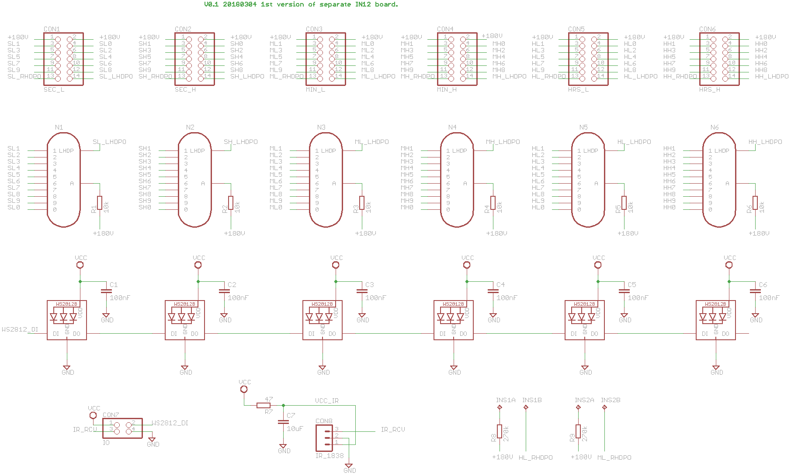
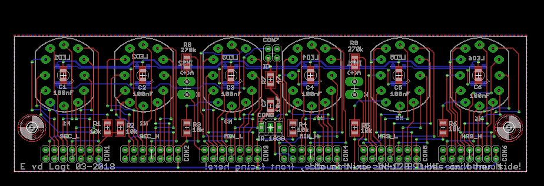
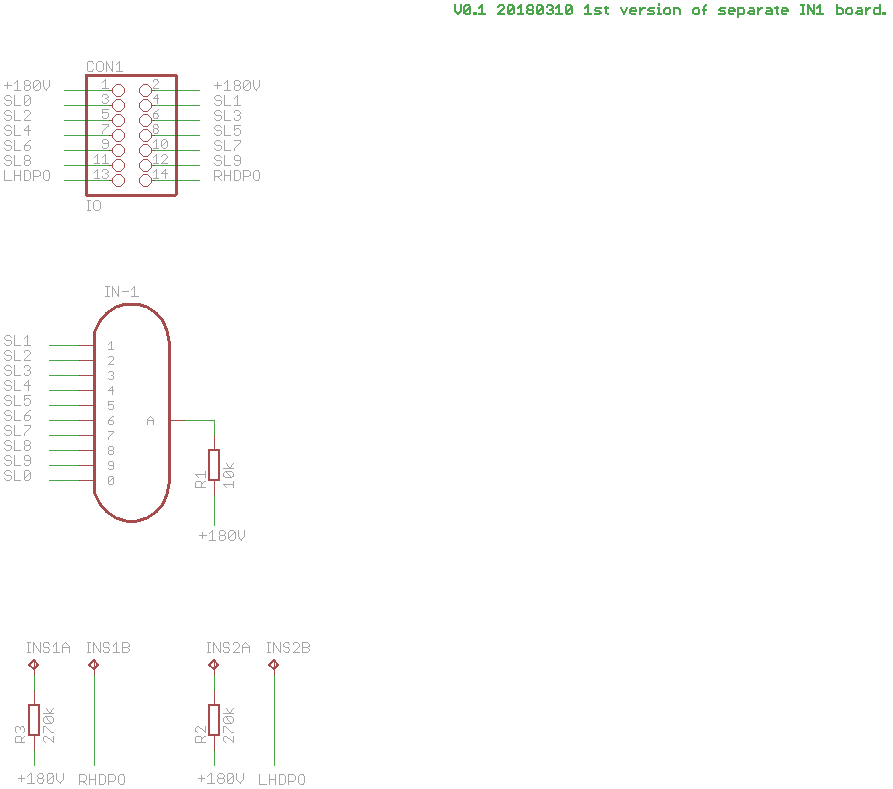
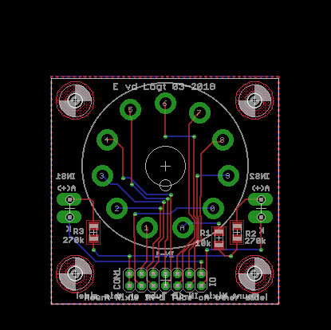

# Nixie_SW
Arduino Nano firmware for Nixie_PCB

 
*Front view of a working Nixie clock*

Based on an idea from Martijn and Ronald, a Nixie PCB has been made. This project contains the firmware for it and uses an Arduino Nano. It consists of the following:
- A Nixie base-board containing the Arduino Nano, a DS3231 RTC, an IR-receiver, a BME280 and a dedicated high-voltage circuit to generate 170 Volts.
- A separate IN-12 board that connects to the base-board and can be equiped with 6 IN-12 Nixie-Tubes and 6 WS2812 24-bit color LEDs.
- Separate IN-1 boards, one for each IN-1. This is done because an IN-1 nixie is quite large.
- A separate boards for IN-14 Nixies (work in progress)

The Nixie-boards are connected through standard 2x7 pins female connectors to the base-board.

The firmware contains the following features: UART (via USB) interrupt-driven communication, command-interpreter, infrared communication, I2C communication and a task-scheduler (non pre-emptive).

Use with Atmel Studio v6 or higher.

# User Guide
When a terminal is connected to the USB port (38400,N,8,1), the following commands are possible:

- D0: Set Date, e.g. "D0 15-12-2016"
- D1: Set Time, e.g. "D1 7:32:48"
- D2: Get Date and Time
- D3: Get DS3231 Temperature
- D4: Set Start-Time for blanking Nixies Tubes at night, e.g. "D4 11:30". Value is stored in EEPROM.
- D5: Set End-Time for blanking Nixies Tubes at night, e.g. "D5 7:30". Value is stored in EEPROM.

- Lx: set LED colour, with x any number between 0 and 7.

- S0: Show revision number
- S1: List all connected I2C devices
- S2: List all software tasks
- S3: Test all Nixie Tubes

- V0: Set high-voltage relay manually to off
- V1: Set high-voltage relay manually to on
- V2: Set relay to auto-mode (firmware determines on or off position)

# Hardware boards
The following boards have been made with the Eagle PCB Software:

 
*Schematics of the Nixie base-board, version 021*

 
*PCB design of the Nixie base-board, version 021*

 
*Schematics of the Nixie IN-12 board*

 
*PCB design of the Nixie IN-12 board*

 
*Schematics of the Nixie IN-1 board*

 
*PCB design of the Nixie IN-1 board*
