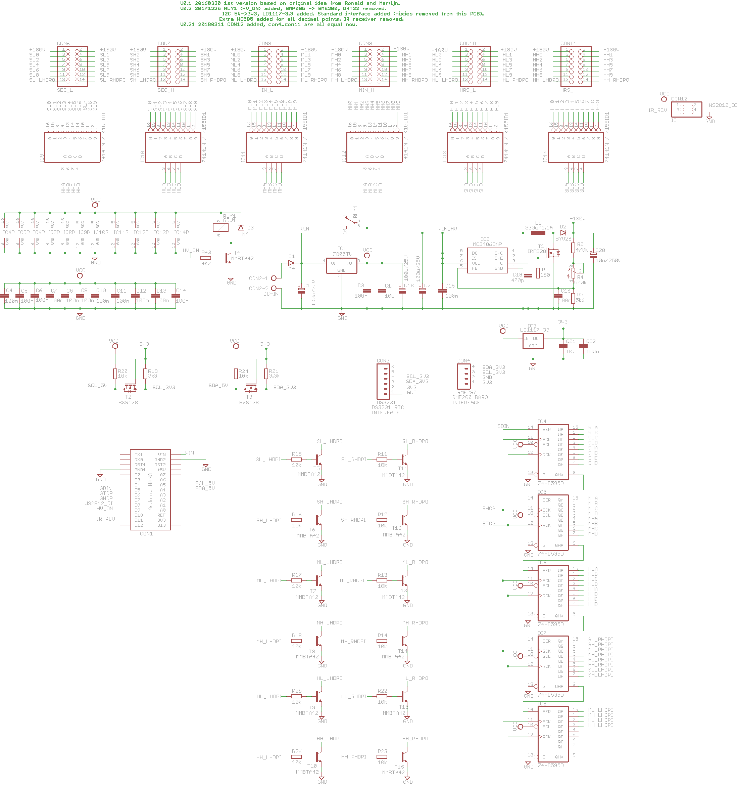
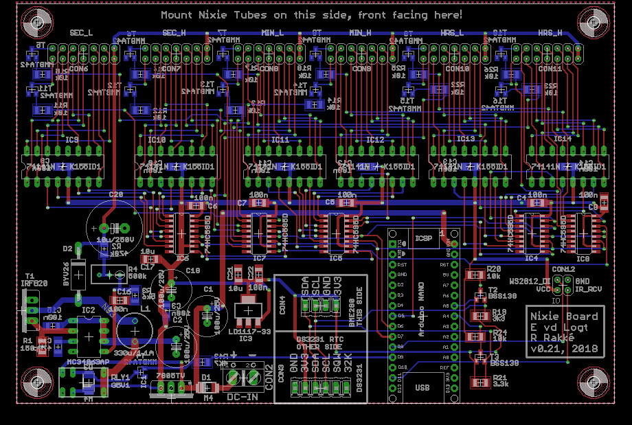

# Nixie Hardware and Software
Arduino Nano firmware for Nixie_PCB

 
*Front view of a working Nixie clock*

Based on an idea from Martijn and Ronald, a Nixie PCB has been made. This project contains the firmware for it and uses an Arduino Nano. It used 6 IN-14 Nixie-Tubes, 6 RGB LEDs, a DS3231 RTC, IR-receiver, a BMP180 and a DHT22 sensor and a dedicated high-voltage circuit to generate 170 Volts.

The firmware contains the following features: UART (via USB) interrupt-driven communication, command-interpreter, infrared communication, I2C communication and a task-scheduler (non pre-emptive).

# Software Development Environment
Use with Atmel Studio v6 or higher.

# User Guide
When a terminal is connected to the USB port (38400,N,8,1), the following commands are possible:

D0: Set Date, e.g. "D0 15-12-2016"
D1: Set Time, e.g. "D1 7:32:48"
D2: Get Date and Time
D3: Get DS3231 Temperature
D4: Set Start-Time for blanking Nixies Tubes at night, e.g. "D4 11:30". Value is stored in EEPROM.
D5: Set End-Time for blanking Nixies Tubes at night, e.g. "D5 7:30". Value is stored in EEPROM.

Lx: set LED colour, with x any number between 0 and 7.

S0: Show revision number
S1: List all connected I2C devices
S2: List all software tasks
S3: Test all Nixie Tubes

# Hardware boards
The boards have been made with the Eagle PCB Software.

 
*Schematic of the Nixie board*

 
*PCB design of the Nixie board*

